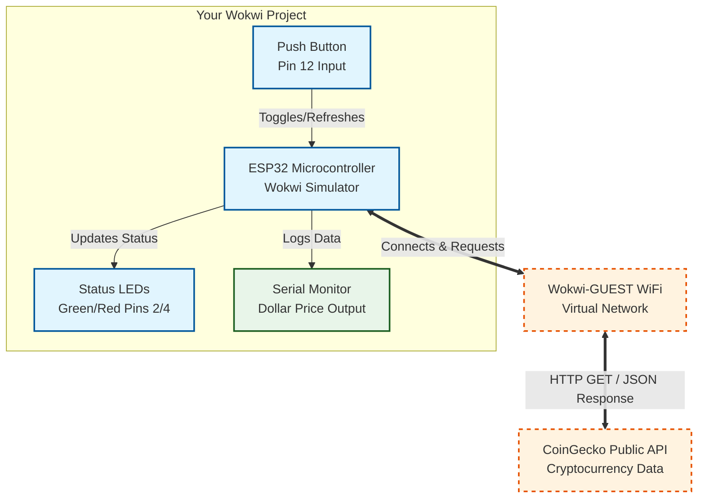

# ENGR 4399 ST: ESP32 WiFi & Live Crypto Ticker System

## Project Overview
This project implements an IoT live financial data ticker using an ESP32 microcontroller in the Wokwi simulator. The system connects to WiFi, queries the CoinGecko REST API for real-time cryptocurrency data, parses the incoming JSON payload, and updates status LEDs based on market performance.

- **Wokwi Simulation Link:** 

## Hardware & Wiring Setup
- **ESP32 Microcontroller**
- **GPIO 12:** Push Button (Input with internal pull-up) -> GND
- **GPIO 2:** Green LED (Price Gain Indicator) -> GND via 220Ω Resistor
- **GPIO 4:** Red LED (Price Drop / Error Indicator) -> GND via 220Ω Resistor

## WiFi and API Details
- **WiFi Network:** `Wokwi-GUEST` (Open)
- **API Endpoint:** CoinGecko Simple Price API (`/api/v3/simple/price`)
- **Data Format:** JSON parsed via `ArduinoJson` library

## System Block Diagram

